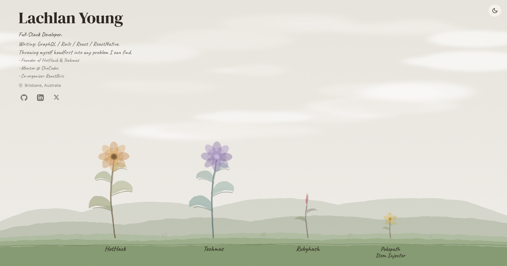

# lachlanyoung.dev

My personal portfolio site — a digital garden showcasing side projects.

**[View Live Site](https://lachlanyoung.dev)**



## Tech Stack

- [Astro](https://astro.build) — Static site generator
- [Tailwind CSS](https://tailwindcss.com) — Styling
- GitHub Pages — Hosting

## Features

- Illustrated garden theme with animated plants
- Dynamic day/night theming based on time of day
- Project showcase as growing flowers
- Responsive design

## Development

```bash
# Install dependencies
npm install

# Start dev server
npm run dev

# Build for production
npm run build
```

## License

MIT
